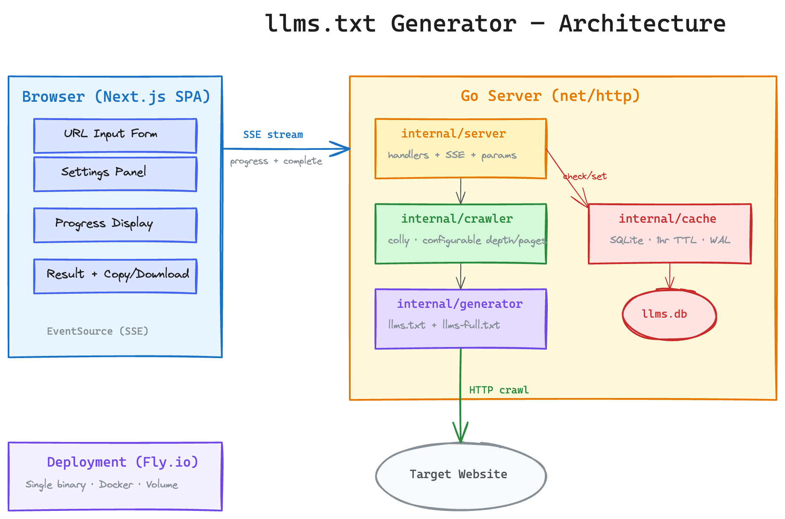

# llms.txt Generator

[](https://github.com/arihanshah/llms/actions/workflows/fly-deploy.yml)
[](https://go.dev)
[](https://nextjs.org)
[](LICENSE)

A web application that generates [llms.txt](https://llmstxt.org) files for any website. Enter a URL, and the tool crawls the site to produce a spec-compliant `llms.txt` or `llms-full.txt` file with real-time progress streaming.

## Architecture



> Editable source: [`architecture.excalidraw`](architecture.excalidraw)

## Quick Start

### Prerequisites
- Go 1.22+
- Node.js 20+

### Development

Run the Go backend and Next.js frontend in separate terminals:

```bash
# Terminal 1: Go API server on :8080
make dev-backend

# Terminal 2: Next.js dev server on :3000
make dev-frontend
```

Open http://localhost:3000.

### Production Build

```bash
make build
./bin/llms
```

Open http://localhost:8080.

## Features

- **Real-time progress** — SSE streaming shows crawl progress as pages are discovered
- **Configurable crawl** — max pages (1–75), crawl depth (1–5), exclude paths
- **Two output formats** — `llms.txt` (links + descriptions) and `llms-full.txt` (full page content)
- **Smart caching** — SQLite cache with 1-hour TTL, settings-aware cache keys
- **One-click export** — copy to clipboard or download as `domain_llms.txt`

## How It Works

1. User enters a website URL and configures settings (depth, page limit, format, exclude paths)
2. The Go backend crawls the site using [colly](https://github.com/gocolly/colly) with the configured limits
3. Pages are classified into sections by URL path structure
4. A spec-compliant output is generated (`llms.txt` or `llms-full.txt`)
5. Results are cached in SQLite for 1 hour (keyed by URL + settings)

Progress is streamed to the browser via Server-Sent Events (SSE).

## API

### `POST /api/generate`
Synchronous generation. Returns the full result as JSON.

```bash
curl -X POST http://localhost:8080/api/generate \
  -H "Content-Type: application/json" \
  -d '{"url": "https://llmstxt.org"}'
```

### `GET /api/generate/stream?url=<url>`
SSE endpoint with real-time crawl progress.

| Param | Description | Default |
|-------|-------------|---------|
| `url` | Target URL to crawl | required |
| `max_pages` | Max pages to crawl (1–75) | 50 |
| `max_depth` | Crawl depth limit (1–5) | 3 |
| `format` | `standard` or `full` | standard |
| `exclude` | Comma-separated path prefixes to skip | — |

```bash
curl -N "http://localhost:8080/api/generate/stream?url=https://htmx.org&max_pages=20&max_depth=2&format=full&exclude=/essays,/discord"
```

Events: `progress` (pages found), `complete` (final result), `error`.

## Deployment

### Fly.io

```bash
fly launch
fly volumes create data --size 8 --region sjc
fly deploy
```

Pushes to `main` trigger automatic deployment via GitHub Actions.

### Docker

```bash
docker build -t llms .
docker run -p 8080:8080 -v llms-data:/data llms
```

## Project Structure

```
├── main.go                 # Entry point
├── internal/
│   ├── crawler/            # colly-based web crawler + page classifier
│   ├── generator/          # llms.txt / llms-full.txt output builder
│   ├── cache/              # SQLite cache with TTL
│   └── server/             # HTTP handlers + SSE streaming
├── web/                    # Next.js frontend (static export)
├── Dockerfile              # Multi-stage build
├── fly.toml                # Fly.io config
└── ARCHITECTURE.md         # Design decisions and tradeoffs
```

## Tech Stack

- **Backend**: Go, [colly](https://github.com/gocolly/colly), [modernc.org/sqlite](https://pkg.go.dev/modernc.org/sqlite)
- **Frontend**: Next.js, TypeScript, Tailwind CSS
- **Deploy**: Fly.io (single container), GitHub Actions CI/CD
